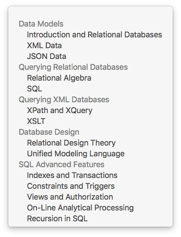

# cs1222-spring-2017

Welcome to CSULA CS1222 Introduction to Relational Databases.  Here are the topics that we will cover for this class.  

This course is based on the Stanford University Database course, with some additional topics.  Note that the primary database system that we will use for this class is
`MySQL`.  Although you can use other DBMS, e.g. `PostgresSQL` or `SQL Server`, however your mileage will vary.

Please refer to the [syllabus](SYLLABUS.md) for more information on the administrative guideline.

Important course news and announcements are posted here, so please check this `README.md` file regularly.

## Announcements

- **5/10/2017** [Study Guide](STUDYGUIDE.md) has been posted.

- **3/21/2017** I've posted [Class Notes](CLASSNOTES.md).  Hopefully this will help you prepare for the midterm.  Once again, the format of the exam is consited of two parts: short answers and progamming.  You can have one note sheet for the short answers part but everything is close.  For the programming part, it's openbook.

- **3/6/2017** Please note that I have to travel conflict with lecture schedule this week.  You will need to watch the following videos:

  - Les Bell's [Creating and Querying a Database Schema with MySQL Workbench](https://youtu.be/EL39BGSUkzw).  This video will give students a more comprehensive tutorial on the various features of a MySQL workbench.

  - Edward Kench's [SQL Outer Joins and Cross Joins Tutorial](https://youtu.be/3t2X1jczt4g).

  - Edward Kench's [SQL Inner Join Multiple Tables with SUM Tutorial](https://youtu.be/NuJn9TVCuK0).

Note that Ed Kench's videos are specific to Microsoft SQL server.  However, we can easily adapt them to MySQL.

- **2/7/2017** I am really sick today -- cannot make it to class.  Therefore, class is canceled.  Please discuss on the gitter if you have questions.

- **1/30/2017** Discussion board is up.  Please visit [https://gitter.im/cs1222-spring-2017/Lobby](https://gitter.im/cs1222-spring-2017/Lobby) for real-time web development excitement.
